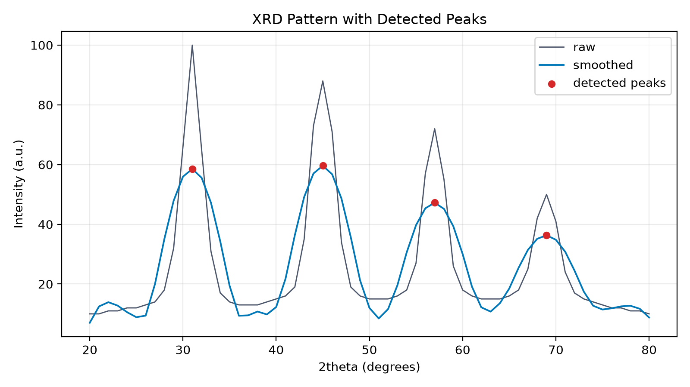
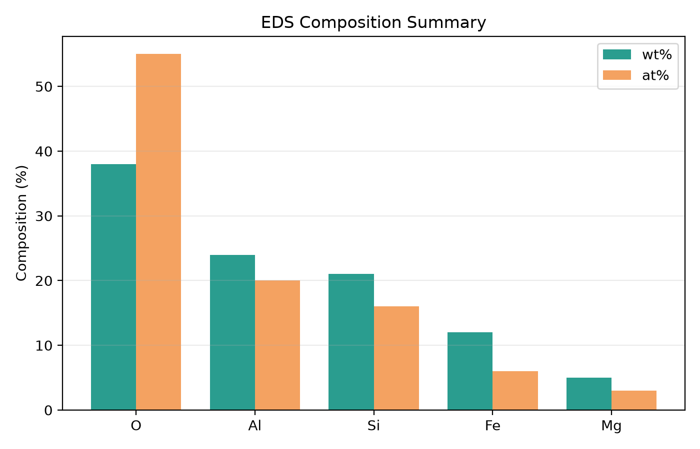

# Materials Characterization Analyzer

[](https://github.com/jhin0410-lgtm/materials-characterization-analyzer/actions/workflows/ci.yml)

`materials-characterization-analyzer` is a small CLI-based Python project for organizing XRD, SEM, and EDS characterization inputs into result tables, plots, and a Markdown report.

The current implementation includes the original XRD/SEM/EDS analysis modules, CLI, report workflow, demo data, and tests, plus v0.2-style import/validation support for selected XRD and EDS input formats. It is intended as a reproducible analysis-support workflow for portfolio and learning purposes. It is not an automatic material identification system, and it does not confirm crystal phases.

## Project Overview

The project provides three analysis modules and one report-generation workflow:

- XRD: reads a two-column diffraction pattern, smooths intensity, detects peaks, estimates FWHM, and saves a plot/table.
- SEM: reads an image, applies threshold-based region detection, measures simple region statistics, and saves overlay/histogram outputs.
- EDS: reads elemental composition data, sorts composition values, and saves a table/chart.
- Report: combines saved XRD, SEM, and EDS result tables into one cautious Markdown summary.
- Optional feature extraction: combines XRD peak metrics, SEM threshold-based region metrics, and EDS composition summaries into one sample-level CSV table for future comparison or modeling workflows.

The repository includes small synthetic/demo inputs under `data/demo/` so the workflow can be run without external files.

## Motivation

Materials characterization often combines evidence from several instruments. XRD, SEM, and EDS results are usually reviewed together, but the raw tables and images often live in separate files. This project demonstrates a compact way to keep those outputs organized and reproducible while avoiding unsupported interpretation.

The project favors clear file handling, cautious wording, and testable helper functions over advanced automation.

## What XRD / SEM / EDS modules do

### XRD

The XRD module expects two-column diffraction data. It supports selected `.csv`, `.txt`, and `.xy` files with header or headerless two-column formats. Standardized columns are:

- `two_theta`
- `intensity`

Supported header aliases include `2theta`, `2 theta`, and `two theta` for `two_theta`, and `counts` for `intensity`. This is a small import layer for simple 2-column patterns, not full vendor-specific raw-format support.

The XRD module can:

- clean and sort numeric pattern data,
- apply Savitzky-Golay smoothing when enough points are available,
- detect peaks with configurable prominence and distance parameters,
- estimate FWHM for detected peaks,
- optionally add Scherrer crystallite size estimates when wavelength information is supplied,
- save `xrd_pattern_with_peaks.png` and `xrd_peak_table.csv`.

The XRD module does not identify phases. It does not use a reference database, and detected peak positions are not used to assert or confirm possible phases.

### SEM

The SEM module expects an image file and a manually supplied `microns-per-pixel` scale. It can:

- read the image with OpenCV,
- convert the image to grayscale,
- apply Otsu thresholding,
- find external contours above a minimum area,
- estimate area, equivalent diameter, perimeter, and area fraction,
- save `sem_overlay.png`, `sem_particle_size_distribution.png`, and `sem_measurements.csv`.

The SEM workflow is intentionally simple. Threshold-based measurements depend on image quality, contrast, noise, threshold conditions, magnification, sample preparation, and the chosen scale value.

### EDS

The EDS module expects a composition table CSV. Standardized columns are:

- `element`
- `weight_percent`
- `atomic_percent`

Supported aliases include `Element` and `ELEMENT` for `element`; `wt_percent`, `Wt%`, `Weight %`, and `Weight Percent` for `weight_percent`; and `at_percent`, `At%`, `Atomic %`, and `Atomic Percent` for `atomic_percent`.

The EDS module can:

- clean elemental composition rows,
- sort elements by weight percent,
- generate a grouped weight-percent/atomic-percent chart,
- save `eds_composition_table.csv` and `eds_composition_bar_chart.png`,
- produce a cautious text summary.

EDS is used here for elemental composition review only. EDS alone does not determine crystal structure or confirm crystalline phases.

## Project Structure

```text
materials-characterization-analyzer/
|-- .github/
|   `-- workflows/
|       `-- ci.yml
|-- README.md
|-- pyproject.toml
|-- requirements.txt
|-- data/
|   `-- demo/
|       |-- README.md
|       |-- synthetic_xrd.csv
|       |-- synthetic_sem.png
|       `-- synthetic_eds.csv
|-- docs/
|   |-- analysis_limitations.md
|   `-- images/
|       |-- README.md
|       |-- xrd_result.png
|       |-- sem_overlay.png
|       `-- eds_composition_chart.png
|-- outputs/
|   `-- .gitkeep
|-- src/
|   `-- mca/
|       |-- cli.py
|       |-- __init__.py
|       |-- importers.py
|       |-- xrd.py
|       |-- sem.py
|       |-- eds.py
|       |-- report.py
|       `-- utils.py
`-- tests/
    |-- test_xrd.py
    |-- test_sem.py
    |-- test_eds.py
    |-- test_importers.py
    `-- conftest.py
```

`outputs/` is a local run-results folder and is ignored by Git except for `outputs/.gitkeep`. README example images are preserved separately in `docs/images/`.

## Installation

Python `3.10` or newer is required.

`pyproject.toml` is the primary project/dependency definition. Create and activate a virtual environment, then install the project in editable mode with test dependencies:

```bash
python -m venv .venv
source .venv/bin/activate
pip install -e ".[dev]"
```

On Windows PowerShell:

```powershell
python -m venv .venv
.\.venv\Scripts\Activate.ps1
pip install -e ".[dev]"
```

As an alternative simple local setup, `requirements.txt` lists the same runtime dependencies plus `pytest` for test execution:

```bash
pip install -r requirements.txt
```

## Quick Start

After installation, run the full demo workflow from the project root:

```bash
python -m mca.cli analyze-all \
  --xrd data/demo/synthetic_xrd.csv \
  --sem data/demo/synthetic_sem.png \
  --eds data/demo/synthetic_eds.csv \
  --microns-per-pixel 0.05 \
  --output outputs
```

On Windows PowerShell:

```powershell
python -m mca.cli analyze-all `
  --xrd data/demo/synthetic_xrd.csv `
  --sem data/demo/synthetic_sem.png `
  --eds data/demo/synthetic_eds.csv `
  --microns-per-pixel 0.05 `
  --output outputs
```

The same modules can also be run individually:

```bash
python -m mca.cli xrd --input data/demo/synthetic_xrd.csv --output outputs
python -m mca.cli sem --input data/demo/synthetic_sem.png --microns-per-pixel 0.05 --output outputs
python -m mca.cli eds --input data/demo/synthetic_eds.csv --output outputs
python -m mca.cli report --xrd outputs/xrd_peak_table.csv --sem outputs/sem_measurements.csv --eds outputs/eds_composition_table.csv --output outputs
```

Optional feature extraction can be enabled during `analyze-all`:

```bash
python -m mca.cli analyze-all \
  --xrd data/demo/synthetic_xrd.csv \
  --sem data/demo/synthetic_sem.png \
  --eds data/demo/synthetic_eds.csv \
  --microns-per-pixel 0.05 \
  --output outputs \
  --extract-features \
  --sample-id demo_synthetic_sample
```

This writes `outputs/sample_features.csv`. The feature table is intended as structured input for future comparison or modeling workflows; this project does not train property prediction models or deep learning models.

## Demo Data Notice

All files in `data/demo/` are synthetic/demo files created only to exercise the workflow:

- `synthetic_xrd.csv` is artificial XRD-like intensity data with generated peaks.
- `synthetic_sem.png` is a simple generated image with bright regions on a dark background.
- `synthetic_eds.csv` is a synthetic elemental composition table.

These files are not real experimental measurements, not instrument exports, and not evidence for any actual material. Example figures generated from these files should be described as synthetic/demo output only.

See [`data/demo/README.md`](data/demo/README.md) before adding or replacing demo inputs.

## Example Outputs

The images below were generated from the synthetic/demo inputs by the Quick Start command and copied from `outputs/` into `docs/images/` for README display. See [`docs/images/README.md`](docs/images/README.md) for the image-source commands.

### XRD result image



### SEM overlay image


### EDS composition chart



The full workflow writes these run artifacts to `outputs/`:

- `xrd_pattern_with_peaks.png`
- `xrd_peak_table.csv`
- `sem_overlay.png`
- `sem_particle_size_distribution.png`
- `sem_measurements.csv`
- `eds_composition_table.csv`
- `eds_composition_bar_chart.png`
- `material_characterization_report.md`
- `sample_features.csv` when `--extract-features` is used

## Limitations

- This project is an analysis-support tool, not a material identification tool.
- XRD peak detection and FWHM extraction do not confirm phases.
- Scherrer estimates, when enabled, are approximate crystallite size estimates and are not particle size measurements.
- SEM segmentation uses simple thresholding, so results depend strongly on image quality, contrast, threshold conditions, scale calibration, and preprocessing choices.
- EDS summarizes elemental composition only. EDS alone does not determine crystal structure or confirm crystalline phases.
- The demo workflow does not include uncertainty propagation, calibration metadata, or reference-database interpretation workflows.
- The optional feature table is a structured summary for future comparison or modeling workflows. This project does not train property prediction models, classification models, or deep learning models.

See [docs/analysis_limitations.md](docs/analysis_limitations.md) for a more detailed discussion.

## Testing

Run the test suite from the project root:

```bash
pytest -q
```

Pytest is configured to place temporary files under the ignored `outputs/pytest-tmp` folder. This avoids local Windows temp-directory permission issues while keeping test artifacts out of Git.

## Related Project

[`materials-data-analyzer`](https://github.com/jhin0410-lgtm/materials-data-analyzer) is a separate project for materials engineering experiment, process, quality, and reliability datasets stored as CSV files.

This project focuses on XRD, SEM, and EDS characterization data. `materials-data-analyzer` focuses on organizing and analyzing tabular engineering datasets rather than instrument-specific spectra, images, or elemental composition workflows.

## Future Work

- Add manual threshold controls and preprocessing options for SEM workflows.
- Add optional XRD background subtraction and more configurable peak-detection parameters.
- Add calibration and uncertainty metadata fields to generated reports.
- Support multiple EDS points, line scans, or maps in one report.
- Explore reference-database-assisted candidate phase matching as a future workflow, with clear separation between candidate suggestions and confirmed phase identification.
- Explore ML or AI segmentation only as a future optional extension after the threshold-based baseline remains transparent and testable.
- Export reports to PDF or DOCX after the Markdown workflow is stable.


